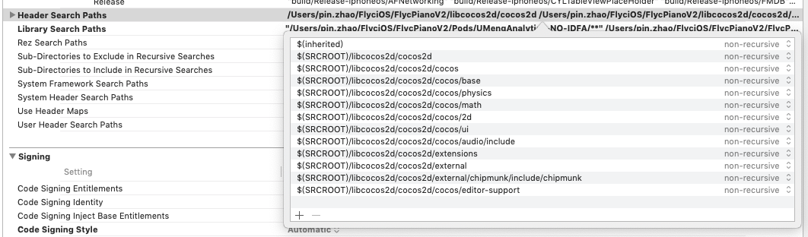
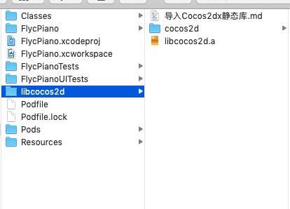

##在已经有的项目里面导入Cocos2dx.

1. 把libcocos2d拷贝到 .xcodeproj 文件的同一级目录下面
2. 把 libcocos2d.a 添加进项目.

3. 在项目中配置中选择targets,在Build Settings -> Header Search Paths 添加

`
$(inherited) $(SRCROOT)/libcocos2d/cocos2d $(SRCROOT)/libcocos2d/cocos2d/cocos $(SRCROOT)/libcocos2d/cocos2d/cocos/base $(SRCROOT)/libcocos2d/cocos2d/cocos/physics $(SRCROOT)/libcocos2d/cocos2d/cocos/math $(SRCROOT)/libcocos2d/cocos2d/cocos/2d $(SRCROOT)/libcocos2d/cocos2d/cocos/ui $(SRCROOT)/libcocos2d/cocos2d/cocos/audio/include $(SRCROOT)/libcocos2d/cocos2d/extensions $(SRCROOT)/libcocos2d/cocos2d/external $(SRCROOT)/libcocos2d/cocos2d/external/chipmunk/include/chipmunk $(SRCROOT)/libcocos2d/cocos2d/cocos/editor-support
`

添加 Header Search Paths 后
-

-

最后文件结构
-

本头文件删除了 cocos2d 里面没有用的 .c .cc .m .mm .cpp .txt Android win10 等文件和文件夹.
